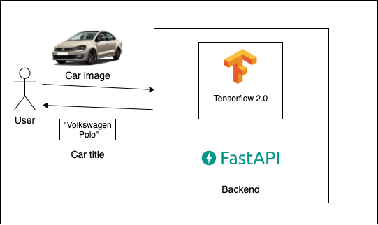

### Local setup :computer:

* Donwload app
```
# clone app
git clone https://github.com/BondaiKa/Car-Model-Classification.git

# change your working dir to project's path
cd project/path
```

* Install docker [Docker](https://docs.docker.com/)   

If you don't have docker in your computer, you should install it [Docker](https://docs.docker.com/)   

#### Running app by docker container :whale:

* To run container:

```bash
docker-compose up
```
Information about the project
---
* Project documentation [details](docs/project_documentation.md)


* Arhitecture of the service


